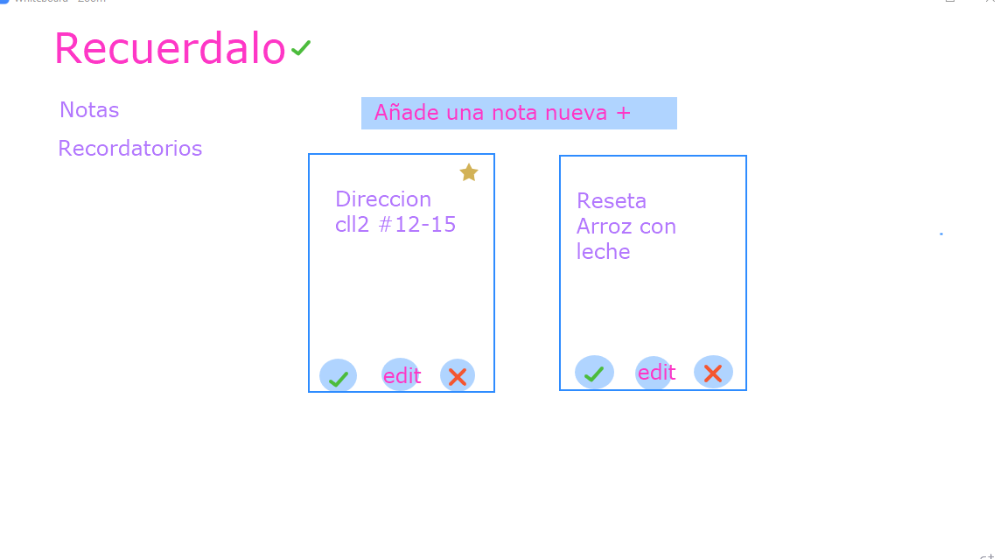
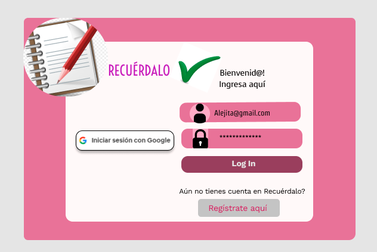
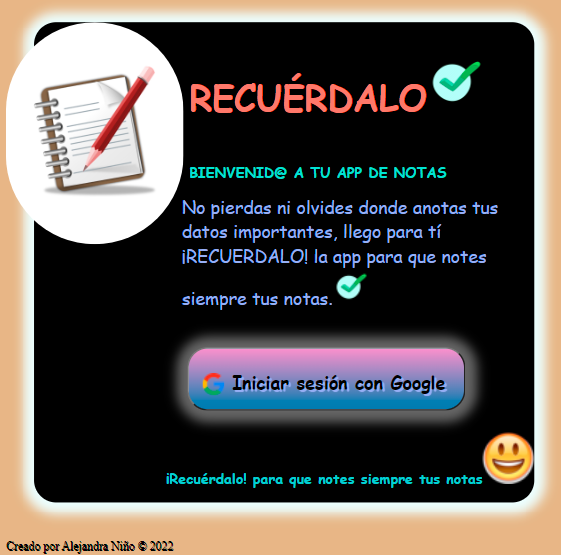
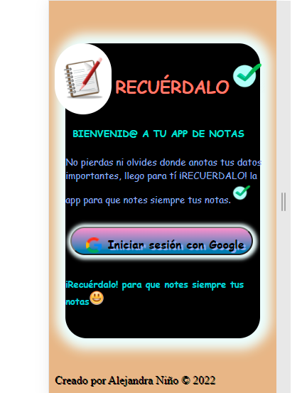
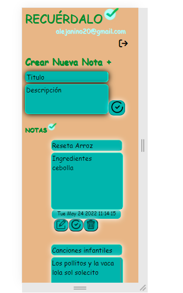
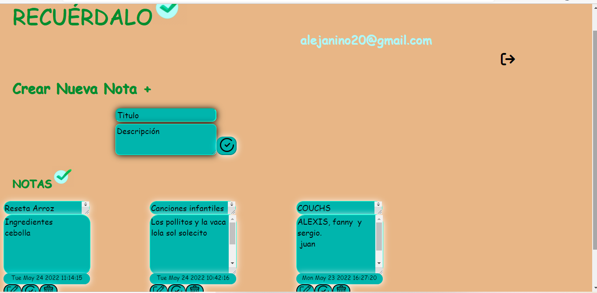
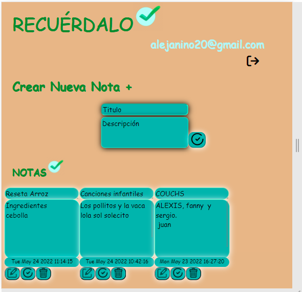

# Lab Notes RECUERDALO

Recuerdalo es una App de notas donde los usuarios pueden guardar informacion importante como alguna dirección, número telefónico, notas de alguna reunión o URLs favoritas para poder consultarlas más tarde. Muchas veces para esta actividad se utilizan libretas o agendas que terminan siendo olvidadas, o se anotan de manera dispersa de tal manera que se pieden de vista la prioridad y el propósito de la nota lo cual da como resultado una nota perdida.

Por esta razon llega RECUERDALO, para que notes siempre tus notas. 

## Investigación UX:
A travez de una entrevista a distintas personas identificamos que les gustaria que la app tuviera y que problemas querian que resolviera, como la de tener al alcanze sus notas sin que se perdieran y que pudieran borrar las que ya no usaran y editar las que quisieran actualizar.

## Historias de usuario
Tomamos en cuenta los conceptos y sugerencias de las entrevistass para crear las Historias de Usuario, asi definimos 
05 historias de usuario y a partir de estas seguimos los principios que se requieren para crear cada una de ellas como:

### HU #1  Debería poder crear cuenta, iniciar y cerrar sesión
Yo como usuario debo poder crear una cuenta y autenticarme usando login de Google para acceder a mis notas.

### HU #2 Debería poder tomar nota
Yo como usuario quiero tomar nota para no depender de mi mala memoria y tener presente en todo momento los apuntes ó cosas importantes que antes escribía en papel.

### HU #3 Debería poder ver las notas
Yo como usuaria quiero leer mis notas para recordar lo que escribí antes.

### HU #4 Debería poder editar las notas
Yo como usuaria quiero editar notas para poder modificar lo que escribí antes.

### HU #5 Debería poder borrar notas
Yo como usuaria quiero borrar una nota para no volver a verla.

## Prototipo de baja fidelidad

Este prototipo es de como queriamos que se viera la vista de notas de la app se diseño en pizarra de zoom y si se asemeja al resultado final.

## prototipo alta fidelidad.

Recibí feedback del prototipo de alta fidelidad con respecto si se debia o no agregar el espacio para usuario y contraseña pues uno de los requerimientos del proyecto era que el usuario se logueara con su cuenta de Google, al
final lo pude modificar para no incluir la otra funcionalidad.

### La imagen final del proyecto.
 

